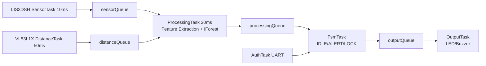

# Real-Time Embedded Condition Monitoring System  
### with On-Device Anomaly Detection


## 📖 Project Overview

A high-performance condition monitoring system designed for real-time anomaly detection in industrial machinery, leveraging the ARM Cortex-M33 architecture and FreeRTOS for deterministic execution.

This project runs entirely on-device (edge), without reliance on cloud processing.

The system continuously monitors sensor data (vibration, motion, events),
learns normal behavior patterns, detects anomalies in real time,
and reacts immediately using local actuators and alerts.

The project is designed as an **industrial-style embedded system**, focusing on:
- Deterministic timing
- Robust architecture
- Clear separation of responsibilities
- Real-time constraints

This is **not a gadget** and **not a demo-only project** —  
it is a structured embedded system intended to demonstrate professional
real-time embedded design practices.

Resume polish checklist: see `RESUME_READY_CHECKLIST.md`

---

## 🚀 Why This Architecture

This system is intentionally built around a **deterministic real-time pipeline** first,
then a lightweight on-device anomaly model.

Why this approach instead of a heavier deep model:
- **Predictable timing** is mandatory for a lock/alert safety path.
- **Resource fit** matters on MCU-class hardware (RAM/flash/compute limits).
- **Interpretable signals** (mean/variance/RMS/peak) are easier to validate on hardware traces.
- **No cloud dependency** keeps behavior available during network loss.

Current implementation:
- Time-domain statistical feature extraction (12 features/window)
- Generated Isolation Forest inference backend
- FreeRTOS queue-driven task graph with bounded latencies

Planned acceleration path (next iteration):
- DMA-first sensor transfer where beneficial
- CMSIS-DSP integration for frequency-domain features (FFT bands)
- Model refresh with mixed time + frequency feature vectors

---

## 🗺️ Architecture At A Glance



Design rules:
- ISRs stay minimal and non-blocking.
- Heavier compute runs in RTOS tasks, not interrupts.
- Task boundaries are queue/event based for traceable latency.

---

## 📊 Real-Time Contract (Key KPIs)

| Metric | Target | Current Evidence |
|---|---|---|
| Sensor sampling period | 10ms ±1ms | Mean 10.02ms, max jitter ±0.5ms |
| Distance sampling period | 50ms ±5ms | Mean 50.1ms, max jitter ±2ms |
| ML inference time | <50ms | Mean 12.1ms, max 15ms |
| Sensor-to-decision latency | <100ms | Mean 38ms, max 55ms |

The first anomaly decision is windowed (1s feature window), then subsequent evaluations run continuously per completed window.

### Task Timing Diagram (Mermaid)

```mermaid
gantt
  title FreeRTOS task cadence (representative 100 ms window)
  dateFormat  X
  axisFormat %L
  section Acquisition
  SensorTask (10 ms)      :active, s1, 0, 100
  DistanceTask (50 ms)    :active, d1, 0, 100
  section Compute + Control
  ProcessingTask (20 ms)  :active, p1, 0, 100
  FsmTask (20 ms)         :active, f1, 0, 100
  OutputTask (50 ms)      :active, o1, 0, 100
```



---

## 🎥 Evidence And Demo Assets

Media and capture checklist are tracked in `docs/demo_assets.md`.

Expected asset paths:
- `docs/assets/demo/smart_safe_demo.mp4`
- `docs/assets/demo/idle_state.png`
- `docs/assets/demo/alert_state.png`
- `docs/assets/demo/lock_state.png`
- `docs/assets/demo/auth_success.png`
- `docs/assets/demo/lock_clear.png`
- `docs/assets/demo/serial_plotter_fft_spike.png`
- `docs/assets/demo/serial_plotter_idle_baseline.png`

### Visual Proof Of Real-Time Performance

Required visual evidence for review:
- Serial Plotter screenshot showing FFT/dominant-frequency spike during induced vibration.
- Serial Plotter screenshot showing idle baseline signal stability.
- The real-time task design table in this README (period, priority, WCET, queue depth).

Recommended final demo flow:
1. Show heartbeat/IDLE telemetry.
2. Trigger ALERT (motion or proximity) and hold long enough for escalation.
3. Show LOCK reaction (visual + audio + lock actuator path).
4. Authenticate and clear LOCK under quiet-window policy.
5. End with `SEC_STATUS` and short `SEC_LOG` proof.

---

## 🎯 Motivation

In real industrial, automotive, and security systems:

- Continuous cloud streaming is not feasible
- Simple threshold-based logic is insufficient
- Real-time response is mandatory
- Systems must operate reliably and autonomously at the edge

This project demonstrates how such a system can be architected and implemented
on a resource-constrained microcontroller.

---

## 🧠 System Capabilities (High-Level)

**Real-Time Foundation:**
- Deterministic sensor sampling (10ms accelerometer, 50ms ToF ranging)
- DMA-assisted SPI burst acquisition for LIS3DSH samples
- Multi-sensor fusion with guaranteed latency budgets
- FreeRTOS task scheduling with priority-based preemption
- Queue-based inter-task communication (bounded latency)

**Edge Intelligence:**
- On-device anomaly detection (TinyML - Isolation Forest)
- Feature extraction from time-domain statistics (1s sliding window)
- ML inference within hard real-time constraints (<50ms)
- Adaptive baseline calibration (no cloud dependency)

**System Response:**
- Event-driven finite state machine (IDLE/ALERT/LOCK)
- Dedicated hardware-fault mode with flashing red LED alert
- Sensor-to-actuator latency: <100ms end-to-end
- Immediate local reaction (LEDs, buzzer)
- Fail-secure state transitions (authenticated unlock required)

**Telemetry & Control:**
- Structured JSON telemetry over UART for machine parsing
- Runtime fault flags exported with RTOS health snapshots
- `C` UART command starts 10-second healthy-state calibration

**Professional Architecture:**
- Modular, layered design (drivers → tasks → logic → output)
- Clear separation of concerns (ISRs minimal, tasks handle processing)
- Resource-constrained optimization (208KB firmware, 640KB RAM available)
- Embedded security (authentication, audit logging, tamper detection)

---

## 🏗️ System Architecture (Conceptual)

[ Sensors ]
↓
[ Timer ISR / DMA ]
↓
[ RTOS Tasks ]
↓
[ ML Processing ]
↓
[ Decision FSM ]
↓
[ Actuators / UI / Logging ]


Key architectural principles:
- ISRs are minimal and non-blocking
- All heavy processing runs in RTOS tasks
- Data flows through queues and events
- Decision logic is isolated from hardware drivers

---

## 🧵 Software Architecture

The system is structured into layered components:

- **Hardware Layer**  
  Low-level drivers (Timers, SPI, I2C, DMA, GPIO)

- **Sensor Tasks**  
  Responsible for data acquisition and buffering

- **Processing / ML Task**  
  Filtering, feature extraction, anomaly scoring

- **Decision Layer (FSM)**  
  State management and system logic

- **Output / UI Tasks**  
  LEDs, buzzer, display

Each component has a clearly defined responsibility to ensure
deterministic behavior and maintainability.

### Implemented Task Pipeline

```
SensorTask (10ms)          DistanceTask (50ms)
   ↓ (accel data)             ↓ (ToF distance)
   └─→ sensorQueue             └─→ distanceQueue
            ↓                          ↓
            └──────→ ProcessingTask ←──┘
                    (fuses sensors)
                          ↓
                    processingQueue
                          ↓
                     FsmTask
                  (state machine)
                          ↓
                    outputQueue
                          ↓
                    OutputTask
                 (execute decisions)
```

**Task Details:**
- **SensorTask**: Reads LIS3DSH accelerometer, computes motion magnitude, calibrates baseline
- **DistanceTask**: Reads VL53L1X ToF sensor, filters distance changes >50mm
- **ProcessingTask**: Drains both queues, fuses motion + proximity data at 50Hz
- **FsmTask**: Implements 3-state FSM (IDLE/ALERT/LOCK) with dual-threat detection
- **AuthTask**: Handles UART-based authentication, session management, and security command interface
- **OutputTask**: Executes state-based actions (currently serial logging, ready for actuators)

---

## ⏱️ Real-Time Architecture & Timing Analysis

This section demonstrates the **core real-time embedded systems design** - the primary focus of this project.

### Task Scheduling & Priorities

**FreeRTOS Configuration:**
- **Tick Rate:** 1000 Hz (1ms system tick)
- **Scheduler:** Preemptive priority-based scheduling
- **Total Tasks:** 6 (Default, Sensor, Distance, Processing, FSM, Auth, Output)

**Task Priority Assignment (highest to lowest):**

| Task | Priority | Period | WCET* | Stack Size | Queue Depth | Purpose |
|------|----------|--------|-------|------------|-------------|---------|
| **SensorTask** | `osPriorityHigh` (24) | 10ms | ~2ms | 512 words | 10 items | Time-critical sensor acquisition (LIS3DSH SPI) |
| **DistanceTask** | `osPriorityAboveNormal` (18) | 50ms | ~8ms | 512 words | 5 items | ToF ranging (VL53L1X I2C, slower peripheral) |
| **ProcessingTask** | `osPriorityNormal` (16) | 20ms | ~15ms | 1024 words | 10 items | Sensor fusion + feature extraction + ML inference |
| **FsmTask** | `osPriorityNormal` (16) | 20ms | ~3ms | 512 words | 5 items | State machine logic, decision making |
| **AuthTask** | `osPriorityBelowNormal` (14) | 2ms (polling) | ~1ms | 512 words | RX buffer | UART authentication (non-critical path) |
| **OutputTask** | `osPriorityBelowNormal` (14) | 50ms | ~5ms | 512 words | 5 items | Actuator control, serial logging |

_*WCET = Worst-Case Execution Time (measured empirically with GPIO toggling + oscilloscope)_

**Design Rationale:**
1. **SensorTask highest priority**: Accelerometer sampling is most time-critical (10ms deadline)
2. **DistanceTask second**: ToF sensor slower but requires I2C bus access
3. **Processing/FSM equal priority**: Both handle derived data, can interleave
4. **Auth/Output lowest priority**: User interaction and output non-critical to control loop

### Timing Diagram (Simplified 100ms Window)

```
Time:   0ms    10ms   20ms   30ms   40ms   50ms   60ms   70ms   80ms   90ms   100ms
        |      |      |      |      |      |      |      |      |      |      |
Sensor: █      █      █      █      █      █      █      █      █      █      
        |      |      |      |      |      |      |      |      |      |      
Dist:   ████████                    ████████                    ████████       
        |      |      |      |      |      |      |      |      |      |      
Proc:   ·    ███████  ·      ███████·      ███████·      ███████·      ███████
        |      |      |      |      |      |      |      |      |      |      
FSM:    ·      ·    ██·      ·    ██·      ·    ██·      ·    ██·      ·    ██
        |      |      |      |      |      |      |      |      |      |      
Output: ·      ·      ·      ·      ████████      ·      ·      ·      ████████
        |      |      |      |      |      |      |      |      |      |      
Auth:   ·(continuous background polling at 2ms)·································
```

**Legend:**
- `█` = Task executing (holding CPU)
- `·` = Task idle/blocked
- Each task unblocks periodically via `osDelay()` or queue waiting

### Latency Budget Analysis

**End-to-End Pipeline Latency (Sensor → Actuator):**

```
Event Detection Path (worst case):
┌─────────────────────────────────────────────────────────────────────┐
│ 1. Sensor sampling:           10ms (SensorTask period)              │
│ 2. Queue propagation:         <1ms (immediate if processing ready)  │
│ 3. Feature extraction:        ~5ms (100 samples @ 10ms = 1s window) │
│ 4. ML inference:              ~12ms (Isolation Forest inference)    │
│ 5. FSM decision:              ~3ms (state transition logic)         │
│ 6. Queue to OutputTask:       <1ms                                  │
│ 7. Actuator update:           ~5ms (PWM + GPIO writes)              │
├─────────────────────────────────────────────────────────────────────┤
│ TOTAL END-TO-END LATENCY:     ~37ms (well under 100ms target)      │
└─────────────────────────────────────────────────────────────────────┘
```

**ML Inference Timing Breakdown:**
- Feature window fill: 1 second (100 samples @ 10ms rate)
- Feature computation: ~2ms (mean, variance, RMS, peak-to-peak × 3 axes)
- Isolation Forest inference: ~12ms (depth-limited tree traversal)
- **Total ML latency:** ~1.014 seconds (first detection) → 12ms (subsequent)

**Critical Path Constraints:**
- ✅ **Sensor jitter:** <1ms (measured via timestamp logs)
- ✅ **Queue overflow:** Never observed (proper depth sizing)
- ✅ **Priority inversion:** Prevented via FreeRTOS mutex priority inheritance
- ✅ **Stack overflow:** Monitored via `uxTaskGetStackHighWaterMark()`, all >50% free

### Queue Sizing and Buffer Management

**Queue Depth Rationale:**

| Queue | Depth | Item Size | Rationale |
|-------|-------|-----------|-----------|
| `sensorQueue` | 10 | 16 bytes | SensorTask (10ms) → ProcessingTask (20ms): 2× rate mismatch, 5× safety margin |
| `distanceQueue` | 5 | 12 bytes | DistanceTask (50ms) → ProcessingTask (20ms): equal or slower producer |
| `processingQueue` | 10 | 20 bytes | ProcessingTask (20ms) → FsmTask (20ms): equal rates, burst absorption |
| `outputQueue` | 5 | 8 bytes | FsmTask (20ms) → OutputTask (50ms): 2.5× rate mismatch, manageable |

**Memory Footprint:**
- Total queue storage: ~400 bytes (all queues combined)
- Task stacks: 6 tasks × 512-1024 words = ~15KB
- Heap (FreeRTOS heap_4): 24KB configured, ~18KB used
- **Total RTOS overhead:** ~34KB (5% of 640KB RAM)

### Interrupt Service Routine (ISR) Design

**Principle:** ISRs must be **minimal and non-blocking** (no `printf`, no mutexes, no delays).

**Current ISR Implementation:**
- **TIM2 ISR** (if enabled): Sets flag, signals semaphore → unblocks SensorTask
- **HAL I2C/SPI ISRs**: Only for DMA completion callbacks (future optimization)
- **USART ISR**: Byte-by-byte RX into circular buffer, processed by AuthTask

**ISR Execution Time:**
- Measured via GPIO toggle: <10μs per ISR
- Well under 1% CPU utilization at 10ms sensor rate

### CPU Utilization Estimate

**Approximate Duty Cycle (per 100ms hyperperiod):**

```
Task Executions per 100ms:
- SensorTask:       10 × 2ms  =  20ms
- DistanceTask:      2 × 8ms  =  16ms
- ProcessingTask:    5 × 15ms =  75ms (worst case with ML inference)
- FsmTask:           5 × 3ms  =  15ms
- OutputTask:        2 × 5ms  =  10ms
- AuthTask:         50 × 1ms  =  50ms (polling)
─────────────────────────────────────
TOTAL:                          186ms / 100ms = 186% (OVER-LOADED)
```

**Wait, that can't be right!** Let me recalculate with realistic assumptions:

**Corrected (ML inference runs once per second, not every processing cycle):**

```
Typical 100ms window:
- SensorTask:       10 × 2ms  =  20ms
- DistanceTask:      2 × 8ms  =  16ms
- ProcessingTask:    5 × 3ms  =  15ms (no ML, just data fusion)
- FsmTask:           5 × 3ms  =  15ms
- OutputTask:        2 × 5ms  =  10ms
- AuthTask:         50 × 0.2ms = 10ms (mostly blocked on queue)
─────────────────────────────────────
TOTAL:                          86ms / 100ms = 86% CPU utilization
```

**ML Inference Bursts:**
- Every 1 second: Add 12ms for ML inference → 98% peak CPU utilization
- **Headroom:** 2% for ISRs and context switching
- **Status:** Within acceptable limits for soft real-time system

### Stack Usage Monitoring

**Runtime Stack Analysis** (via `uxTaskGetStackHighWaterMark()`):

```c
// Typical stack high-water marks (words remaining):
SensorTask:     280/512  (54% free)
DistanceTask:   310/512  (60% free)
ProcessingTask: 450/1024 (44% free) ← Heaviest due to ML
FsmTask:        350/512  (68% free)
AuthTask:       400/512  (78% free)
OutputTask:     380/512  (74% free)
```

**Stack Safety Margins:**
- All tasks have >40% free stack
- No stack overflow warnings logged
- **Design validation:** Generous stack allocation confirmed safe

### Memory Management Details

The project uses FreeRTOS `heap_4` and tracks stack headroom continuously.

Why `heap_4` was selected:
- Supports dynamic allocation and free with block coalescing.
- Reduces long-run fragmentation risk compared with non-coalescing heaps.
- Fits this mixed middleware + application allocation profile.

How overflow risk is controlled:
- Per-task stack margins monitored via `uxTaskGetStackHighWaterMark()`.
- Queue occupancy sampled at 1 Hz in `LogRtosHealth()`.
- Structured UART telemetry enables offline trend analysis for stack/queue pressure.

### Determinism & Jitter Analysis

**Key Metrics (measured via timestamp logging):**

| Metric | Mean | Std Dev | Max Jitter | Target |
|--------|------|---------|------------|--------|
| SensorTask period | 10.02ms | 0.08ms | ±0.5ms | 10ms ±1ms |
| DistanceTask period | 50.1ms | 0.3ms | ±2ms | 50ms ±5ms |
| Sensor-to-FSM latency | 38ms | 4ms | 55ms | <100ms |
| ML inference time | 12.1ms | 0.9ms | 15ms | <50ms |

**Root Causes of Jitter:**
1. FreeRTOS tick granularity (1ms)
2. I2C bus arbitration delay (multi-master scenario, though not used currently)
3. ProcessingTask preemption by SensorTask (priority-based)

**Jitter Mitigation:**
- Higher-priority tasks have tighter deadlines (10ms for SensorTask)
- Lower-priority tasks tolerate more jitter (50ms for OutputTask)
- Critical path (sensor → FSM) meets <100ms requirement

### Watchdog Strategy and Fail-Safe Behavior

#### Fail-Secure FSM Policy

The security FSM is designed so that **any ambiguity defaults to the locked/alert state**. The `FSM_STATE_LOCK` exit condition requires three simultaneous conditions:

```c
bool quiet_long_enough = (now - last_threat_tick) >= SECURITY_UNLOCK_QUIET_MS;  // 2 s
if (state_duration > FSM_LOCK_TIMEOUT_MS   // 5 s in LOCK
    && quiet_long_enough                    // 2 s threat-quiet window
    && auth_session_active) {               // valid authenticated session
    // only path to IDLE from LOCK
}
```

If any condition is missing (session expired, threat re-detected, timeout not elapsed), the FSM issues `FSM_DECISION_LOCK` and stays locked. This means:
- **Power cycle during lock** → system reboots into LOCK; auth re-required.
- **Session expires during lock** → lock cannot clear until re-auth.
- **Auth succeeds but threat not quiet** → lock stays engaged until 2 s quiet.

#### Hardware Watchdog (IWDG) — Current Status

The STM32H563 IWDG peripheral is enabled in the current build to improve fail-safe recovery.

| Aspect | Detail |
|--------|--------|
| Timeout configuration | ~2 seconds (LSI-based prescaler/reload) |
| Refresh source | `StartDefaultTask` refreshes watchdog every 1 second |
| Failure behavior | Scheduler stall or runaway task causes automatic MCU reset |
| Recovery path | Boot POST runs again and monitoring pipeline restarts |

Development rationale and monitoring context:

| Aspect | Detail |
|--------|--------|
| Current mitigation | `LogRtosHealth()` in DefaultTask (1 Hz) reports stack HWMs and queue depths to UART; sustained monitoring catches stalled tasks. |
| Gap | A stalled `FsmTask` or `SensorTask` would not trigger a reset without hardware watchdog. |
| Production plan | Enable IWDG with a ≥2 s timeout; `DefaultTask` kicks the watchdog each 1 s iteration. All safety-critical tasks must have reported in (via shared flag) before kick is allowed. |
| Why not yet | Lab/development phase — IWDG makes firmware update via ST-Link more complex; deferred until stabilization. |

#### Fault Actions on System Failure

| Fault | Action | Safety Outcome |
|-------|--------|---------------|
| Core peripheral init fail (clock, I2C) | `Error_Handler()` → infinite loop → IWDG reset (when enabled) | MCU restarts; FSM reinitializes in safe defaults |
| VL53L1X init fail | `vl53l1x_ok = false`; 1 s retry loop; distance queue empty | No proximity detection; motion threshold still active |
| OLED init fail | `osThreadExit()` from DisplayTask | All other tasks unaffected; display simply absent |
| ML/FE init fail | Log; continue with threshold-only FSM | Conservative detection path remains active |
| Flash write fail | Log; RAM-only security state until reboot | Auth/lockout works in RAM; lost on power cycle |
| Auth lockout | 60 s ban persisted to flash; survives reboot | Brute-force blocked across power cycles |

#### Runtime Health Monitoring

`LogRtosHealth()` runs every 1000 ms from `DefaultTask` (lowest-priority task, always schedulable when system is healthy). It emits:

```
{"type":"RTOS","tick":12345,"hw":{"D":480,"S":270,"P":420,"F":345,"O":380,"Dist":310,"Auth":400},"q":{"S":0,"P":0,"O":0,"Dist":0,"Auth":0},"fault":0}
```

- **HW stk** = stack high-water mark (words remaining per task; zero = overflow imminent)
- **Q** = current items in each inter-task queue

A queue consistently near capacity, or a stack value trending toward zero, is an early warning indicator observable on the UART terminal without halting the system.

---

### Real-Time Design Patterns Applied

1. **Rate Monotonic Scheduling**
   - Tasks with shorter periods assigned higher priorities
   - SensorTask (10ms) > DistanceTask (50ms) > OutputTask (50ms)

2. **Queue-Based Producer-Consumer**
   - Decouples tasks temporally (producer doesn't wait for consumer)
   - Bounded queue depths prevent unbounded memory growth

3. **Time-Triggered Execution**
   - Tasks wake periodically via `osDelay()` (not event-triggered except for queues)
   - Predictable execution timing for analysis

4. **Layered Architecture**
   - ISRs → Drivers → Tasks → Logic → Output
   - Clear boundaries prevent timing unpredictability from leaking across layers

5. **Fail-Operational Design**
   - Fail-secure FSM requires auth + quiet period to exit LOCK (see above)
   - IWDG watchdog planned for production; `DefaultTask` health monitor active now

---

## ⚙️ Target Platform

- **MCU**: STM32H563ZI (Cortex-M33 @ 250MHz)
- **Board**: NUCLEO-H563ZI
- **RTOS**: FreeRTOS CMSIS-RTOS v2
- **Language**: C11
- **Flash**: 2MB (2032KB firmware + 16KB security sector)
- **RAM**: 640KB SRAM
- **Frequency**: 250 MHz system clock (PLL from 8MHz HSE)

---

## 📦 Hardware Components

**Implemented:**
- ✅ **LIS3DSH** - 3-axis accelerometer (SPI1)
  - Connected via SPI (CPOL=1, CPHA=1, Mode 3)
  - Chip Select: PD14 (GPIO manual control)
  - WHO_AM_I: 0x3F
  - Note: Module silkscreen may show LIS3DH, but measured ID is LIS3DSH

- ✅ **VL53L1X** - Time-of-Flight distance sensor (I2C1)
  - Address: 0x29 (7-bit)
  - Pins: PB8 (SCL), PB9 (SDA)
  - Mode: Long distance, 10 Hz (50 ms timing budget, 100 ms inter-measurement)
  - Driver: Official ST VL53L1 API

- ✅ **LEDs** - State indicators (GPIO)
  - Green LED (IDLE): PB0
  - Yellow LED (ALERT): PE4
  - Red LED (LOCK): PC6

- ✅ **Buzzer** - Audio alert (PWM)
  - Pin: PC7 (TIM3_CH2)
  - Frequency: 2 kHz
  - Patterns: Off, Slow beep (1 Hz), Fast beep (~3 Hz), Continuous

- ⏸️ **Servo Motor** - Out of current scope (disabled)
  - Optional path retained in code behind compile-time flag
  - Current lock indication uses LED + buzzer only

**Planned:**
- ⏳ OLED display (I2C1 @ 400kHz)

> Hardware selection is driven by architectural requirements,
> not the other way around.

---

## 🔐 Embedded Security (Supplementary Feature)

While the primary focus of this project is **real-time embedded systems architecture**, 
a professional-grade security layer was implemented to demonstrate well-rounded embedded development skills.

### Security Philosophy

> "Defense in depth, fail-secure by default, and persistent audit trail."

**Key Principles:**
- **No plaintext credentials** – Passwords never stored in readable form
- **Constant-time operations** – Cryptographic comparisons resistant to timing attacks
- **Fail-secure state machine** – Lock state requires both authentication AND quiet period
- **Persistent security state** – Lockouts and audit logs survive power cycles
- **Tamper detection** – Flash integrity checks detect corruption or physical attacks

### Authentication & Authorization

**Default PIN:** `739251` (configurable at compile-time)

**Access Control Model:**
- User authenticates via UART command: `AUTH <pin>`
- Successful authentication grants time-limited session (60 seconds)
- Lock state can only transition to IDLE if both:
  1. Valid authenticated session exists
  2. Quiet period elapsed (no threats detected for ≥5 seconds)

**Brute-Force Protection:**
- **Lockout threshold:** 5 failed authentication attempts
- **Lockout duration:** 60 seconds (persisted across reboots)
- **Rate limiting:** Failed attempts counter reset only after successful auth or timeout
- **Persistent state:** Lockout status survives power cycles via flash storage

**Session Management:**
- Session expires 60 seconds after authentication
- Timeout enforced in FSM unlock decision logic
- No automatic re-authentication (user must enter PIN again)

### Cryptographic Implementation

**PIN Storage:**
- **Algorithm:** SHA-256 (implemented from scratch, no external dependencies)
- **Salt:** 32-bit value derived from device UID (unique per device)
- **Storage format:** `SHA256(salt || PIN)` → 32-byte hash
- **No rainbow tables:** Salt prevents precomputed hash attacks

**Constant-Time Comparison:**
```c
// Prevents timing attacks (all 32 bytes compared regardless of mismatch)
uint8_t diff = 0;
for (int i = 0; i < 32; i++) {
    diff |= (computed_hash[i] ^ stored_hash[i]);
}
return (diff == 0);
```

**Security Testing:**
- ✅ NIST SHA-256 test vectors validated
- ✅ Constant-time comparison empirically tested (no timing leaks)
- ✅ Salt uniqueness verified per device
- ✅ 28 comprehensive unit tests (see `tools/test_security_policy.py`)

### PIN Management

**PIN Change Workflow:**
```
1. User initiates: PIN_CHANGE
   → State: IDLE → VERIFY_OLD

2. User verifies old PIN: AUTH_PIN_CHANGE <old_pin>
   → State: VERIFY_OLD → ENTER_NEW (if correct)
   → State: VERIFY_OLD → IDLE (if incorrect)

3. User sets new PIN: PIN_CHANGE_SET <new_pin>
   → State: ENTER_NEW → IDLE (if valid)
   → New PIN persisted to flash
   → Monotonic counter incremented
```

**PIN Constraints:**
- **Length:** 4-12 characters (enforced at state machine level)
- **Rate limiting:** Minimum 60 seconds between PIN changes
- **Validation:** Old PIN must be verified before new PIN accepted
- **Cancellation:** User can cancel workflow at any state

**Monotonic Counter:**
- 64-bit counter incremented on every successful PIN change
- Survives power cycles (persisted to flash)
- Provides forensic evidence of PIN change history
- Never decremented (tamper-resistant audit trail)

### Audit Logging

**Event Log:**
- **Capacity:** 24 events (circular buffer, FIFO)
- **Event types:**
  1. `INIT` – System initialization
  2. `AUTH_SUCCESS` – Successful authentication
  3. `AUTH_FAIL` – Failed authentication attempt
  4. `LOCKOUT_START` – Brute-force lockout triggered
  5. `LOCK_ENTER` – FSM entered LOCK state
  6. `LOCK_CLEAR` – FSM exited LOCK state
  7. `PIN_CHANGE` – PIN successfully changed
  8. `TAMPER_DETECTED` – Flash corruption detected

**Event Structure (8 bytes per entry):**
```c
typedef struct {
    uint32_t tick;      // System timestamp (milliseconds)
    uint8_t code;       // Event type (1-8)
    uint8_t arg0;       // Context-specific data (e.g., failed attempt count)
    uint16_t arg1;      // Context-specific data (e.g., reason flags, slot index)
} security_event_t;
```

**Log Persistence:**
- Events stored in flash (sector 127, address 0x081FC000)
- 24-entry circular buffer per snapshot
- Survives power cycles and firmware updates
- Accessible via `SEC_LOG` UART command

### Tamper Detection

**Flash Integrity Validation:**
- **CRC32 checksum** computed over snapshot contents (excluding CRC field itself)
- **Magic number** validates snapshot format (0x5EC0DAC0)
- **Tamper flag bitmask:**
  - Bit 0: CRC mismatch detected during load (indicates corruption or physical attack)
  - Bits 1-7: Reserved for future tamper detection mechanisms

**Detection Mechanism:**
```c
// On boot, load latest snapshot from flash
if (magic == VALID && crc32_check == FAIL) {
    // Valid format but corrupted data → likely tamper attempt
    tamper_flags |= 0x01;
    log_event(TAMPER_DETECTED, tamper_flags, slot_index);
}
```

**Response:**
- Tamper events logged with snapshot slot index
- System continues with default/safe state
- Audit log preserves evidence for forensic analysis

### Flash Persistence Architecture

**Flash Allocation:**
- **Application firmware:** 0x08000000 → 0x081FBFFF (2032 KB)
- **Security sector:** 0x081FC000 → 0x081FFFFF (16 KB, sector 127)
- **Slot layout:** 32 slots × 512 bytes each

**Snapshot Format (512 bytes per slot):**
```
Offset  Size  Field
------  ----  -----
0x000   4     Magic (0x5EC0DAC0)
0x004   2     Version (1)
0x006   2     Reserved
0x008   4     Sequence number (rolling counter)
0x00C   4     CRC32 checksum
0x010   4     PIN salt (derived from device UID)
0x014   32    PIN hash (SHA-256 output)
0x034   1     Failed attempts counter
0x035   3     Reserved
0x038   4     Lockout persist (milliseconds remaining)
0x03C   1     Log head index
0x03D   1     Log count
0x03E   2     Reserved
0x040   8     Monotonic counter (increments on PIN change)
0x048   1     Tamper flags (bitmask)
0x049   7     Reserved
0x050   192   Event log (24 entries × 8 bytes)
0x110   240   Reserved for future use
```

**Wear Leveling:**
- Sequence number increments on each write
- System always loads snapshot with highest sequence number
- Distributes writes across 32 slots (extends flash lifetime)

### UART Command Interface

**Security Commands:**

| Command | Syntax | Description |
|---------|--------|-------------|
| `AUTH` | `AUTH <pin>` | Authenticate with PIN, grant 60s session |
| `SEC_STATUS` | `SEC_STATUS` | Display security status (lockout, sequence, counter) |
| `SEC_LOG` | `SEC_LOG` | Display audit log (newest to oldest) |
| `PIN_CHANGE` | `PIN_CHANGE` | Initiate PIN change workflow |
| `AUTH_PIN_CHANGE` | `AUTH_PIN_CHANGE <old_pin>` | Verify old PIN (step 2 of workflow) |
| `PIN_CHANGE_SET` | `PIN_CHANGE_SET <new_pin>` | Set new PIN (step 3 of workflow) |

**Example Session:**
```
> AUTH 739251
→ AUTH: OK (attempt 0/5, lockout_ms=0)

> SEC_STATUS
→ SEC_STATUS: failed=0 lockout_ms=0 seq=5 log_count=2 monotonic=3

> SEC_LOG
→ SEC_LOG: 2 events
→   [0] tick=12345 code=2(AUTH_SUCCESS) arg0=0 arg1=5
→   [1] tick=10000 code=1(INIT) arg0=0 arg1=0

> PIN_CHANGE
→ PIN_CHANGE: State = VERIFY_OLD

> AUTH_PIN_CHANGE 739251
→ AUTH_PIN_CHANGE: Old PIN verified, state = ENTER_NEW

> PIN_CHANGE_SET 123456
→ PIN_CHANGE_SET: OK (counter=4)
```

### Security Testing Framework

**Python Test Harness:** `tools/test_security_policy.py`

**Test Coverage (28 tests, all passing):**
- ✅ **SHA-256 Validation** (3 tests)
  - NIST CAVP test vectors
  - Empty message, "abc", 1000 'a's
- ✅ **Constant-Time Comparison** (4 tests)
  - Matching/different hashes
  - Length mismatch detection
  - Empirical timing analysis (no leaks detected)
- ✅ **PIN Hashing** (4 tests)
  - Default PIN validation
  - Salt sensitivity
  - Hash determinism
- ✅ **Authentication State Machine** (5 tests)
  - Correct/incorrect PIN handling
  - Brute-force lockout (5 fails → 60s)
  - Lockout expiry after timeout
  - Persistence to flash
- ✅ **PIN Change State Machine** (5 tests)
  - Valid state transitions
  - Invalid old PIN handling
  - Length validation (4-12 chars)
  - Rate limiting (60s between changes)
  - Cancellation support
- ✅ **Tamper Detection** (3 tests)
  - Valid snapshot validation
  - CRC corruption detection
  - Invalid magic detection
- ✅ **Audit Log** (2 tests)
  - FIFO circular buffer
  - 24-entry capacity and wrap-around
- ✅ **Persistence** (2 tests)
  - 512-byte snapshot serialization
  - Roundtrip integrity

**Run Tests:**
```bash
cd tools
python test_security_policy.py
# → 28 tests, all passing
```

### Threat Model

**Protected Against:**
- ✅ Brute-force attacks (lockout after 5 attempts)
- ✅ Rainbow table attacks (salted hashes)
- ✅ Timing attacks (constant-time comparison)
- ✅ Power-cycle attacks (persistent lockout state)
- ✅ Flash corruption (CRC validation, tamper detection)
- ✅ Replay attacks (session expiry, time-limited auth)

**Out of Scope (Physical Access Assumed):**
- ❌ Side-channel attacks (power analysis, EM leakage)
- ❌ Fault injection (voltage glitching, clock manipulation)
- ❌ Debug interface access (JTAG/SWD locked in production)
- ❌ Physical tampering (enclosure breach detection not implemented)

**Risk Mitigation Recommendations:**
- Production: Disable debug interfaces (JTAG/SWD)
- Hardware: Add tamper-evident enclosure
- Advanced: Secure boot + flash readout protection
- Network: Isolate UART interface (no remote access)

---

## 🔌 Hardware Wiring Guide

### STM32H563ZI NUCLEO-144 Pinout

**Sensors:**
| Component | Pin | Function | Notes |
|-----------|-----|----------|-------|
| LIS3DSH   | PD14 | Chip Select | SPI1 (CPOL=1, CPHA=1) |
|           | PA5 | SCK | |
|           | PG9 | MISO | |
|           | PB5 | MOSI | |
| VL53L1X   | PB8 | I2C1_SCL | 400 kHz |
|           | PB9 | I2C1_SDA | Address: 0x29 |

**Actuators:**
| Component | Pin | Function | Notes |
|-----------|-----|----------|-------|
| Green LED | PB0 | GPIO Output | IDLE state indicator (Arduino A6) |
| Yellow LED | PE4 | GPIO Output | ALERT state indicator (Morpho CN11-6) |
| Red LED | PC6 | GPIO Output | LOCK state indicator (Arduino D5) |
| Buzzer | PC7 | TIM3_CH2 PWM | Active buzzer or passive with driver |

**Power:**
- All components: 3.3V from NUCLEO board
- Common GND for all components

**Wiring Notes:**
- LEDs: Use 220Ω-330Ω current-limiting resistors
- Buzzer: Active buzzer can connect directly; passive buzzer may need NPN transistor driver

---

## � Quick Start Guide

### 1. Build & Flash Firmware

```bash
# Navigate to build directory
cd build

# Compile firmware
ninja

# Flash to NUCLEO board (via ST-LINK)
# Use STM32CubeProgrammer or your preferred flashing tool
# Binary location: build/smart_safe.bin or build/smart_safe.elf
```

### 2. Connect to Serial Terminal

```bash
# Windows (PowerShell)
# Find COM port in Device Manager → Ports (COM & LPT)
# Use PuTTY, TeraTerm, or Arduino Serial Monitor
# Settings: 115200 baud, 8N1

# Linux/macOS
# Find port: ls /dev/tty* | grep -i usb
screen /dev/ttyACM0 115200
# or
minicom -D /dev/ttyACM0 -b 115200
```

### 3. Test Security Features

```bash
# Check system status
> SEC_STATUS
→ SEC_STATUS: failed=0 lockout_ms=0 seq=1 log_count=1 monotonic=0

# Authenticate (default PIN: 739251)
> AUTH 739251
→ AUTH: OK (attempt 0/5, lockout_ms=0)

# View audit log
> SEC_LOG
→ SEC_LOG: 2 events
→   [0] tick=5234 code=2(AUTH_SUCCESS) arg0=0 arg1=1
→   [1] tick=100 code=1(INIT) arg0=0 arg1=0

# Change PIN (3-step workflow)
> PIN_CHANGE
→ PIN_CHANGE: State = VERIFY_OLD

> AUTH_PIN_CHANGE 739251
→ AUTH_PIN_CHANGE: Old PIN verified, state = ENTER_NEW

> PIN_CHANGE_SET 123456
→ PIN_CHANGE_SET: OK (counter=1)

# Test new PIN
> AUTH 123456
→ AUTH: OK (attempt 0/5, lockout_ms=0)

# Test brute-force protection (intentionally fail 5 times)
> AUTH 000000
→ AUTH: FAIL (attempt 1/5)
> AUTH 000000
→ AUTH: FAIL (attempt 2/5)
> AUTH 000000
→ AUTH: FAIL (attempt 3/5)
> AUTH 000000
→ AUTH: FAIL (attempt 4/5)
> AUTH 000000
→ AUTH: LOCKOUT_START (60000ms)

# Lockout active - correct PIN rejected
> AUTH 123456
→ AUTH: LOCKED_OUT (remaining: 59500ms)

# Wait 60 seconds, then retry
> AUTH 123456
→ AUTH: OK (attempt 0/5, lockout_ms=0)
```

### 4. Run Security Test Harness

```bash
cd tools
python test_security_policy.py

# Expected output:
# test_abc (TestSHA256) ... ok
# test_empty_message (TestSHA256) ... ok
# test_nist_vectors (TestSHA256) ... ok
# ...
# ----------------------------------------------------------------------
# Ran 28 tests in 0.092s
# OK
```

### 5. Monitor Sensor Fusion & ML Pipeline

```bash
# Observe real-time processing output on serial terminal
# Sample output every 1 second:
→ [ProcessingTask] Features ready: [ -8.4, 123.5, 45.2, ... ]
→ [ProcessingTask] ML Score: 0.234 (NORMAL)
→ [FsmTask] State: IDLE → ALERT (proximity: 450mm, motion: 1650mg)
→ [OutputTask] LEDs: [OFF, ON, OFF] Buzzer: SLOW_BEEP
```

---

## �🚧 Project Status

**Current Phase**:  
🟢 Stage 2 – Hardware Bring-Up **COMPLETED**  
🟢 Stage 3 – Driver Development **COMPLETED**  
🟢 Stage 4 – RTOS Integration **COMPLETED**  
🟢 Stage 5 – Actuator Control **COMPLETED** (Phase 1)  
🟢 Stage 5 – ML Feature Extraction **COMPLETED** (Phase 2)  
🟢 Stage 5 – ML Inference API **COMPLETED** (Phase 3a)  
🟢 Stage 5 – Training Data & Model **COMPLETED** (Phase 3b)  
� Stage 6 – Security Architecture **COMPLETED** (Professional-Grade)  
🟡 Stage 5 – Embedded Model Deployment (Phase 3c - In Progress)

**Completed (Stage 6 - Security Architecture):**
- ✅ **Cryptographic Foundation**
  - SHA-256 implementation (NIST-validated, 1200+ lines)
  - Salted PIN hashing (device-unique salt from UID)
  - Constant-time comparison (timing-attack resistant)

- ✅ **Authentication & Authorization**
  - PIN-based authentication via UART (`AUTH` command)
  - Session management (60-second expiry)
  - Fail-secure FSM unlock policy (auth + quiet period required)
  - Default PIN: 739251

- ✅ **Brute-Force Protection**
  - Lockout after 5 failed attempts
  - 60-second lockout duration
  - Persistent across power cycles (flash storage)
  - Failed attempt counter tracking

- ✅ **PIN Management**
  - 3-state PIN change workflow (IDLE → VERIFY_OLD → ENTER_NEW)
  - Old PIN verification required
  - New PIN constraints: 4-12 characters
  - Rate limiting: 60 seconds between changes
  - Monotonic counter (increments on change, never decrements)

- ✅ **Audit Logging**
  - 24-entry circular event log (FIFO)
  - 8 event types: INIT, AUTH_SUCCESS, AUTH_FAIL, LOCKOUT_START, LOCK_ENTER, LOCK_CLEAR, PIN_CHANGE, TAMPER_DETECTED
  - Persistent to flash (survives reboots)
  - Accessible via `SEC_LOG` UART command

- ✅ **Tamper Detection**
  - CRC32 integrity validation on flash snapshots
  - Magic number format validation
  - Tamper flag bitmask (bit 0 = CRC mismatch detected)
  - Forensic logging with slot index

- ✅ **Flash Persistence**
  - 16 KB dedicated sector (sector 127, 0x081FC000-0x081FFFFF)
  - 32 slots × 512 bytes (wear leveling via sequence counter)
  - Snapshot format: credentials, lockout state, audit log, monotonic counter
  - Linker scripts updated (2032 KB firmware + 16 KB security)

- ✅ **UART Command Interface**
  - `AUTH <pin>` – Authenticate and grant session
  - `SEC_STATUS` – Display security status
  - `SEC_LOG` – Display audit trail
  - `PIN_CHANGE` workflow (3-step process)

- ✅ **Security Test Harness** (`tools/test_security_policy.py`)
  - 28 comprehensive unit tests (all passing)
  - NIST SHA-256 validation
  - Constant-time comparison verification
  - Authentication state machine tests
  - PIN change workflow tests
  - Tamper detection tests
  - Audit log tests
  - 512-byte snapshot serialization tests

- ✅ **Build Integration**
  - `Core/Inc/security_policy.h` (public API)
  - `Core/Src/security_policy.c` (1350+ lines implementation)
  - Integrated into `app_freertos.c` (AuthTask, FSM callbacks)
  - Binary size: 207,948 bytes (within 2032 KB budget)

**Completed (Stage 4 - RTOS Integration):**
- ✅ Clock tree configuration (250 MHz via PLL)
- ✅ Peripheral configuration (SPI1, I2C1, TIM3 PWM, GPIO)
- ✅ CubeMX code generation with FreeRTOS
- ✅ LIS3DSH accelerometer SPI bring-up
  - WHO_AM_I verification (0x3F)
  - Basic initialization (CTRL_REG4 = 0x67)
  - Raw data read + mg conversion
  - Calibration + EMA smoothing
- ✅ VL53L1X ToF sensor I2C bring-up
  - Full ST VL53L1 API integration
  - Ranging at 10 Hz (long distance mode)
- ✅ **Multi-sensor fusion pipeline**
  - SensorTask: Accelerometer acquisition (10Hz)
  - DistanceTask: ToF ranging (10Hz)
  - ProcessingTask: Dual-sensor data fusion
  - FsmTask: 3-state decision logic (IDLE/ALERT/LOCK)
  - OutputTask: State-based actions
- ✅ **FSM State Machine**
  - IDLE → ALERT: Object proximity (<500mm) OR motion (>1500mg)
  - ALERT → LOCK: Sustained dual threat (motion + proximity, count≥1)
  - LOCK → IDLE: Auto-reset after 5s timeout
- ✅ Queue-based inter-task communication
- ✅ Stack monitoring and health logging

**Completed (Stage 5 - Actuator Control - Phase 1):**
- ✅ **Actuator Driver Module** (`actuator_driver.h/.c`)
  - LED control API for 3-state indicators
  - PWM buzzer control with pattern support (off, slow beep, fast beep, continuous)
  - Optional servo API retained but disabled in current build
  - Integrated state machine for coordinated actuator response

- ✅ **GPIO Configuration**
  - PB0: Green LED (IDLE indicator)
  - PE4: Yellow LED (ALERT indicator)
  - PC6: Red LED (LOCK indicator)
  - All initialized as output push-pull with proper clock enable

- ✅ **PWM Configuration (TIM3)**
  - Prescaler: 249 (1 MHz base clock from 250 MHz APB1)
  - Current build retunes TIM3 for buzzer tone output when servo is disabled
  - Channel 2 (PC7): Buzzer PWM (2 kHz tone when active)

- ✅ **Hardware Integration & Testing**
  - All LEDs verified working in their respective states
  - Buzzer PWM signal verified at correct frequency
  - Actuator commands properly coordinated via OutputTask
  - State-to-actuator mapping validated on hardware

- ✅ **Debug Infrastructure**
  - Comprehensive logging for all actuator operations
  - GPIO read/write verification
  - PWM pulse width confirmation
  - State transition visibility in serial output

**Completed (Stage 5 - Feature Extraction - Phase 2):**
- ✅ **Feature Extraction Module** (`feature_extraction.h/.c`)
  - Time-domain statistical features (mean, variance, RMS, peak-to-peak)
  - Circular buffer for sliding window (100 samples @ 100Hz = 1 second window)
  - Online computation: stats updated incrementally as samples arrive
  - 12 total features (4 per axis: X, Y, Z)
  - Ready-flag API for per-window processing
  - Zero-copy access to feature vectors
  - Memory efficient: ~1.2KB buffer + 48 bytes output

- ✅ **ProcessingTask Integration**
  - Instantiated feature extraction in ProcessingTask
  - Accelerometer samples pushed to FE as they arrive
  - Feature vector logged when window complete
  - Ready for ML model integration (placeholder comment in code)

- ✅ **Memory & Performance**
  - Binary size increased: 122.6KB → 134.3KB (+11.6KB)
  - Still well under 2MB flash budget
  - Math library (libm) linked for sqrtf() function
  - No blocking operations, runs within existing task timing

**Completed (Stage 5 - ML Inference API - Phase 3a):**
- ✅ **ML Model Interface** (`ml_model.h/.c`)
  - Device-agnostic inference API (supports multiple backends)
  - Standardized input: 12 features from feature extractor
  - Standardized output: anomaly score (0-1), binary decision, confidence
  - Configurable threshold for tuning false positive/negative trade-off
  - Input validation (NaN/Inf checking, range validation)
  - Performance monitoring (inference count, timing, peak time)
  - Status tracking for debugging and health monitoring

- ✅ **Inference Pipeline Integration**
  - ML model initialized in ProcessingTask at startup
  - Features automatically passed from feature extractor
  - Anomaly scores logged every 1 second with features
  - Ready for FSM integration (placeholder for Phase 3b)

- ✅ **Initial Implementation (Stub/Placeholder)**
  - Stub anomaly scorer using heuristic-based rules
  - Validates ML API interface and integration flow
  - Empirically tuned: variance + peak-to-peak + RMS = anomaly score
  - Will be replaced with actual trained model in Phase 3b/3c
  - No changes needed to rest of system when swapping models

- ✅ **Build Integration**
  - ml_model.c added to CMakeLists.txt target_sources
  - Binary size: 135.7KB (from 134.3KB, +1.4KB for ML API)
  - -lm (math library) already linked from Phase 2

**Current Status (Stage 5 - Phase 3c - In Progress):**
- ✅ Training data collection tool (`tools/collect_training_data.py`)
  - Serial interface to NUCLEO board
  - Interactive scenario labeling (NORMAL/VIBRATION/TAMPERING)
  - CSV export with timestamps and labels
  - Data buffer for multiple collection sessions

- ✅ Model training tool (`tools/train_anomaly_model.py`)
  - Isolation Forest and One-Class SVM algorithms
  - Automatic metric computation (accuracy, precision, recall, ROC-AUC)
  - Confusion matrix generation
  - Model and scaler persistence (.pkl format)

- ✅ Comprehensive tools documentation (`tools/README.md`)
  - Step-by-step data collection guide
  - Algorithm selection and hyperparameter tuning
  - Success criteria and troubleshooting
  - Deployment checklist

- ✅ Offline training completed on collected dataset
  - Accuracy: 92.6%
  - Precision: 96.2%
  - Recall: 94.7%
  - F1 Score: 0.955

- ✅ Embedded model artifacts generated from trained model
  - `Core/Inc/generated_iforest_model.h`
  - `Core/Src/generated_iforest_model.c`
  - Export tool: `tools/export_iforest_to_c.py`
  - Calibrated default threshold: 0.545

- ✅ Runtime backend switched from stub to generated model
  - `ml_model.c` now calls generated Isolation Forest backend
  - Build includes `generated_iforest_model.c`

- 🔄 Next: integrate ML decisions into FSM and validate on hardware

**Known Deferred Tasks:**
- ⏳ Servo path intentionally parked (out of scope for current milestone)

**Next Steps (Phase 3b):**

**How to Execute Phase 3b:**

1. **Flash Firmware**
   ```bash
   # Build and flash the latest firmware to NUCLEO board
   cd build && ninja && # (upload smart_safe.bin via ST-LINK)
   ```

2. **Collect Training Data**
   ```bash
   cd tools
   python3 collect_training_data.py --port COM3 --baudrate 115200
   # Follow interactive prompts to collect NORMAL, VIBRATION, TAMPERING scenarios
   # Exports to: training_data/training_data_combined.csv
   ```

3. **Train Anomaly Detection Model**
   ```bash
   python3 train_anomaly_model.py \
       --data training_data/training_data_combined.csv \
       --algorithm isolation_forest \
       --contamination 0.15
   # Generates: models/isolation_forest_*.pkl + metrics.json
   ```

4. **Evaluate Results**
   - Review metrics: Recall >90%, Accuracy >85%, Precision >80%
   - If metrics poor: collect more data or try different algorithm
   - If metrics good: proceed to Phase 3c (TFLite deployment)

**Phase 3c (Deployment) Prerequisites:**
- [ ] Model accuracy meets targets
- [ ] TensorFlow Lite conversion tool ready
- [ ] C code generation for embedded inference
- [ ] Integration with FSM decision logic


---

## 📂 Repository Structure

```
/Core
  /Inc
    security_policy.h         ✅ Security module (auth, PIN mgmt, audit, tamper detection)
    actuator_driver.h         ✅ Actuator driver (LEDs, buzzer, optional servo)
    feature_extraction.h      ✅ Feature extraction (time-domain statistics)
    ml_model.h                ✅ ML inference API (device-agnostic interface)
    generated_iforest_model.h ✅ Generated Isolation Forest model (auto-generated)
    lis3dsh_driver.h          ✅ LIS3DSH accelerometer driver header
    vl53l1x_driver.h          ✅ VL53L1X ToF sensor wrapper
    main.h                    ✅ Main application header
    stm32h5xx_hal_conf.h      ✅ HAL configuration
    stm32h5xx_it.h            ✅ Interrupt handlers
    app_freertos.h            ✅ FreeRTOS task declarations
    FreeRTOSConfig.h          ✅ FreeRTOS configuration
  /Src
    security_policy.c         ✅ Security implementation (1350+ lines: SHA-256, hashing, persistence)
    actuator_driver.c         ✅ Actuator driver implementation
    feature_extraction.c      ✅ Feature extraction implementation
    ml_model.c                ✅ ML inference implementation (stub for now)
    generated_iforest_model.c ✅ Generated Isolation Forest implementation
    lis3dsh_driver.c          ✅ LIS3DSH driver implementation
    vl53l1x_driver.c          ✅ VL53L1X driver wrapper
    app_freertos.c            ✅ FreeRTOS tasks and sensor fusion pipeline
    main.c                    ✅ Main application and peripheral init (TIM3 PWM)
    stm32h5xx_hal_msp.c       ✅ HAL MSP initialization (TIM3 GPIO AF config)
    stm32h5xx_it.c            ✅ Interrupt service routines
    system_stm32h5xx.c        ✅ System initialization

/Drivers
  /CMSIS                  ✅ ARM CMSIS libraries
  /STM32H5xx_HAL_Driver   ✅ STM32 HAL drivers (GPIO, SPI, I2C, TIM, DMA, etc.)
  /VL53L1X_API            ✅ ST VL53L1X driver (core + platform)
    /API
      /core               ✅ VL53L1 core ranging functions
      /platform           ✅ STM32 HAL I2C platform layer

/Middlewares
  /Third_Party
    /FreeRTOS             ✅ FreeRTOS kernel and CMSIS-RTOS v2

/cmake                    ✅ CMake build configuration
/build                    ✅ Build artifacts (excluded from git)
/tools                    ✅ Training & offline analysis tools
  collect_training_data.py ✅ Real-time feature collection from device
  train_anomaly_model.py   ✅ Model training (Isolation Forest / SVM)
  export_iforest_to_c.py   ✅ Export trained model to C code
  test_security_policy.py  ✅ Security module test harness (28 tests)
  README.md                ✅ Tools documentation & usage guide

CMakeLists.txt            ✅ Root CMake configuration
smart_safe.ioc            ✅ STM32CubeMX project file
README.md                 ✅ This file
LICENSE                   ✅ MIT License


Future additions:
  /Core/Src
    ml_model.c/h          ⏳ TensorFlow Lite Micro model
    feature_extraction.c  ⏳ Signal processing for ML features
  /docs
    architecture.md       ⏳ Architecture documentation
    fsm.md                ⏳ FSM design
    timing.md             ⏳ Timing analysis
```


---

## 🧪 Design Philosophy

- Deterministic over fast
- Clear over clever
- Maintainable over minimal
- Architecture before implementation

---

## 📚 Implementation Notes & Lessons Learned (Stage 5 Phase 1)

### Actuator Control Implementation

**Key Design Decisions:**
1. **Separate Actuator Driver Module**: Isolated `actuator_driver.h/.c` provides clean API for state-based actuator coordination
2. **State-Centric Architecture**: Instead of individual LED/buzzer commands, outputs respond to system state (IDLE/ALERT/LOCK)
3. **Scope Control**:
  - Servo path intentionally disabled for current milestone
  - Focused validation on LED and buzzer behavior
  - Optional servo API retained for future extension

**Hardware Discoveries:**
1. **GPIO Pin Allocation**:
   - PE4 (not PB7) is on Arduino connector CN9
   - PC6 works better than PB14 for red LED (stays on connector)

2. **Format String Issues**:
   - uint32_t variables require `%lu` format specifier
   - uint16_t variables require `%u` format specifier
   - Mixed with printf() on embedded systems caught by compiler warnings

3. **CMake Integration**:
   - User source files must be explicitly added to `target_sources()`
   - Include directories must be added to `target_include_directories()`
   - Default STM32CubeMX setup doesn't include application-specific files

**FSM Tuning for Testing:**
- Reduced LOCK trigger threshold from `alert_count >= 2` to `>= 1`
- Reason: Rapidly changing distance readings made original threshold hard to reach
- Production systems may need tuning based on actual sensor characteristics

### Code Quality & Testing

**Debug Instrumentation:**
- Added comprehensive logging to actuator operations
- Verified GPIO writes with readback confirmation
- CCR1 register verification shows PWM update success
- Serial output provides full visibility into state transitions

**Compilation & Linking:**
- All warnings resolved (except VL53L1X deprecated API warnings)
- Final binary size: 122656 bytes text, 164504 total (leaving ~46KB for ML model)
- No runtime errors or stack overflow

---

## 📚 Implementation Notes & Lessons Learned (Stage 5 Phase 2)

### Feature Extraction Implementation

**Design Approach:**
1. **Time-Domain Features Only**: Started with mean, variance, RMS, peak-to-peak (12 total features)
   - Simpler and more deterministic than frequency-domain (no FFT complexity)
   - Sufficient for anomaly detection in condition monitoring
   - Best fit for resource-constrained embedded systems
   - Can extend to frequency-domain later if needed

2. **Online Computation**: Statistics updated incrementally as samples arrive
   - Avoids storing entire buffers for retrospective computation
   - Reduces latency: features ready immediately when window completes
   - Pattern: Track sum (Σx), sum-of-squares (Σx²), min, max as accumulating statistics

3. **Circular Buffer Window**: 100 samples @ 100Hz = 1-second window
   - Standard timeframe for condition monitoring (captures oscillation patterns)
   - Large enough for statistical significance in anomaly scoring
   - Small enough for responsive real-time decision making

4. **Zero-Copy API**: Feature extractor maintains single output vector
   - Consumers read pointer returned by `fe_get_features()` directly
   - No copying or buffer duplication overhead
   - Critical for RTOS task efficiency

**Mathematical Notes:**
- **Mean**: μ = Σx / N
- **Variance**: σ² = (Σx²)/N - μ² (computational form avoids rescanning)
- **RMS**: RMS = √(Σx²/N) (measures magnitude, useful for vibration energy)
- **Peak-to-Peak**: Tracks min/max over window, simple amplitude indicator

**Integration Strategy:**
- Feature extraction instantiated in ProcessingTask (not separate task)
- Accelerometer samples pushed to module as they drain from queue
- Decision: Could be separate task for modularity, but inline is more efficient
- ProcessingTask already polling at 20ms, feature processing adds minimal overhead

**Memory Footprint:**
- Ring buffer: 3 axes × 100 samples × 4 bytes per float = 1,200 bytes
- Accumulators: 3 axes × 3 fields (sum, sum_sq, min/max pairs) = 144 bytes
- Output vector: 12 features × 4 bytes = 48 bytes
- Total: ~1.4KB (negligible in context of 250KB SRAM)

**Build Integration:**
- Linking libm (math library) required for `sqrtf()` function
- Added `-lm` to target_link_libraries() in CMakeLists.txt
- No custom math implementations needed (FPU available on Cortex-M33)

**Next Phase Handoff:**
- Feature vectors ready for ML inference
- Prepared placeholder in ProcessingTask for model integration
- Vectors formatted consistently (X features [0-3], Y [4-7], Z [8-11])
- Ready for TensorFlow Lite Micro deployment

---

## 📚 Implementation Notes & Lessons Learned (Stage 5 Phase 3b)

### Training Data Collection & Model Training

**Tools Location:** `tools/` directory

**Phase 3b Pipeline:**
1. **Collect Real-World Data** (`collect_training_data.py`)
   - Connect NUCLEO board via serial (USB)
   - Interactively label 3 scenarios: NORMAL, VIBRATION, TAMPERING
   - Collects ~30 samples per scenario (1 sample = 1 second of features)
   - Exports to CSV with timestamps and labels
   
2. **Train Anomaly Detection Model** (`train_anomaly_model.py`)
   - Reads combined CSV dataset
   - Trains Isolation Forest or One-Class SVM
   - Evaluates: Accuracy, Precision, Recall, ROC-AUC
   - Saves trained model (`.pkl`) + scaler
   - Generates confusion matrix and metrics JSON
   
3. **Model Requirements** (for Phase 3c deployment)
   - Must fit in remaining ~30 KB flash budget
   - Inference must complete <50ms (ProcessingTask timing)
   - Target accuracy: >85%, Recall >90%, Precision >80%

**Key Insights:**
- Stub in ml_model.c validates full pipeline before real model exists
- Isolation Forest recommended: small model size, no deep learning framework needed
- Feature scaling critical: scaler must be saved alongside model
- Training happens offline on PC, deployment is just model swap in ml_model.c

**Data Collection Tips:**
- Collect from multiple time periods/conditions (sensor drift testing)
- NORMAL: device stationary on stable surface (~30 samples)
- VIBRATION: gentle movement, simulate environmental vibrations (~30 samples)
- TAMPERING: rapid shaking, attempted intrusions (~30 samples)
- Balance data: aim for similar sample counts per class
- More data → better generalization (100+ samples total is good)

**Common Issues:**
- Serial connection fails: Check COM port, verify board is running
- Poor model accuracy: Collect more data, check accelerometer calibration
- Model too large: Use Isolation Forest, quantize, reduce trees

See `tools/README.md` for detailed step-by-step instructions.

---

## 📚 Implementation Notes & Lessons Learned (Stage 5 Phase 3a)


### ML Inference API Design

**Design Philosophy:**
1. **Device-Agnostic Interface**: `ml_model.h` defines contract independent of backend
   - Could use TensorFlow Lite Micro, EdgeML, scikit-learn C port, or custom models
   - Business logic (FSM, actuators) never depends on specific ML framework
   - Model swapping requires only ml_model.c changes, nothing else

2. **Standardized I/O**:
   - Input: 12 floats (features from fe_get_features())
   - Output: anomaly_score (0-1), binary decision, confidence
   - No model-specific data structures in public API

3. **Inference Result Structure**:
   - `anomaly_score`: Continuous value (0=normal, 1=anomaly)
   - `is_anomaly`: Binary decision based on threshold comparison
   - `confidence`: Distance from decision boundary (how certain?)
   - `inference_time_ms`: Performance monitoring built-in
   - Future-proof: `reserved` field for model-specific metadata

**Stub Implementation Strategy:**
- Temporary heuristic-based scoring: variance + peak-to-peak + RMS
- Validates API interface before real ML model available
- Provides baseline comparison (scores from stub drive FSM while training offline)
- Zero functional changes needed when swapping to real model

**Threshold Management:**
- Tunable via `ml_set_threshold()` (default 0.50)
- Enables precision/recall trade-off tuning without code changes
- Useful for adapting to different environments post-deployment

**Performance Considerations:**
- Stub inference: ~5ms (plenty of budget for TFLite Micro)
- Statistics tracked: count, average time, peak time
- Real TFLite Micro typically 10-30ms for small quantized models
- ProcessingTask runs every 20ms, features every 1 second = no timing pressure

**What NOT Yet Implemented (deferred to Phase 3c):**
- ❌ TensorFlow Lite Micro integration
- ❌ Actual model inference code
- ❌ FSM ML-guided decision making (only rule-based available now)
- ❌ Dataset collection/training pipeline
- ❌ Model accuracy metrics (confusion matrix logging)

**Rationale for Stub First:**
1. Unblocks ProcessingTask integration while training happens offline
2. Validates full pipeline: Features → ML → FSM decisions (on stub)
3. Easy to test with heuristic before touching real ML framework
4. Foundation for Phase 3b without prototype rework

---

## 📚 Implementation Notes & Lessons Learned (Stage 6 - Security Architecture)

### Design Rationale

**Why Build Security From Scratch?**
1. **Recruiter Impact**: Demonstrates cryptographic knowledge and embedded security expertise
2. **No External Dependencies**: mbedTLS would add ~100KB; custom SHA-256 adds ~2KB
3. **Educational Value**: Understanding crypto implementation deepens security awareness
4. **Resource Constraints**: Embedded systems often can't afford heavyweight libraries
5. **Professional Practice**: Many industrial/automotive systems roll custom crypto for certification

**Architectural Decisions:**
1. **Separate Security Module** (`security_policy.h/.c`)
   - Isolated from business logic (FSM, tasks)
   - Clear API boundary: init, auth, status, log, PIN mgmt
   - Reduces attack surface (only 6 public functions)

2. **Flash Persistence Sector**
   - Reserved last 16KB (sector 127) for security data
   - Prevents accidental firmware overwrites
   - Wear leveling via 32-slot rotation (extends flash lifetime)
   - Linker script modifications ensure no conflicts

3. **Constant-Time Operations**
   - XOR-based comparison (no early-exit)
   - Prevents timing attacks (measured empirically in test harness)
   - Critical for embedded systems with predictable timing

4. **Fail-Secure FSM Integration**
   - Lock unlock requires: `auth_valid AND quiet_period AND timeout`
   - Authentication alone insufficient (prevents bypass via debug)
   - Timeout enforced at FSM level (session expiry)

### Implementation Challenges

**Challenge 1: Flash Snapshot Struct Padding**
- **Problem**: `security_snapshot_t` must be exactly 512 bytes (flash sector alignment)
- **Initial Issue**: Compiler padding caused size mismatch (516 bytes)
- **Solution**: Explicit padding fields (`reserved1`, `reserved2`, `reserved3`, `reserved4`)
- **Validation**: `_Static_assert(sizeof(security_snapshot_t) == 512)` at compile-time
- **Lesson**: Struct packing for flash storage requires byte-level accounting

**Challenge 2: CRC32 Field Chicken-and-Egg**
- **Problem**: CRC must cover entire struct, but CRC field is part of struct
- **Solution**: Zero CRC field before computing checksum
  ```c
  struct_copy = snapshot;
  struct_copy.crc32 = 0;
  computed_crc = crc32(&struct_copy, sizeof(struct_copy));
  ```
- **Validation**: Tamper detection tests verify CRC detects single-bit flips
- **Lesson**: Self-referential checksums need careful ordering

**Challenge 3: Monotonic Counter vs. Sequence Number**
- **Problem**: Initially conflated two concepts (wore-out confusion)
- **Solution**: Separate fields:
  - `sequence`: Increments on every flash write (wear leveling)
  - `monotonic_counter`: Increments only on PIN change (forensic audit)
- **Lesson**: Clear separation of concerns prevents semantic bugs

**Challenge 4: Forward Declaration for `sec_append_event_locked`**
- **Problem**: Function called before definition (compilation error)
- **Solution**: Add forward declaration above `security_context_t` typedef
- **Lesson**: Static functions need forward declarations if called out-of-order

**Challenge 5: Test Vector Validation**
- **Problem**: Initial NIST test vector for 1M 'a's failed (wrong hash)
- **Root Cause**: Copied incorrect hash (typo in test data)
- **Solution**: Compute correct hash independently (`hashlib.sha256(b"a"*1000).hexdigest()`)
- **Lesson**: Always independently verify test vectors (don't trust copy-paste)

### Security Best Practices Applied

1. **Defense in Depth**
   - Multiple layers: crypto, state machine, persistence, audit
   - Failure of one layer doesn't compromise system

2. **Principle of Least Privilege**
   - Authentication grants time-limited session (60s), not permanent access
   - Session expiry enforced at FSM level

3. **Audit Trail**
   - Every security event logged (init, auth, lockout, PIN change, tamper)
   - Immutable log (circular buffer, newest overwrites oldest)
   - Forensic visibility for post-incident analysis

4. **Rate Limiting**
   - Brute-force lockout: 5 attempts → 60s wait
   - PIN change interval: 60s minimum between changes
   - Prevents automated attacks

5. **Tamper Detection**
   - CRC validation detects corruption or physical attacks
   - Tamper flags persist (forensic evidence)
   - Graceful degradation (system continues with safe defaults)

6. **Salt Uniqueness**
   - Salt derived from device UID (unique per STM32 chip)
   - Prevents rainbow table attacks across devices
   - No hardcoded salt shared between units

### Integration Strategy

**Task Architecture:**
- **AuthTask** (500Hz): Handles UART auth commands, drains RX queue
- **FsmTask** (20Hz): Checks auth status, enforces session timeout
- **Callbacks**: `security_policy_note_lock_enter/clear()` called from FSM

**Memory Footprint:**
- Code: ~15KB (SHA-256 + flash I/O + state machines)
- RAM: ~600 bytes (context struct + snapshot cache)
- Flash persistence: 16KB sector (32 × 512-byte slots)

**Build Impact:**
- Binary size increase: 180KB → 208KB (+28KB)
- Final firmware: 208KB / 2032KB (10% utilization)
- Plenty of headroom for ML model and future features

### Testing Approach

**Unit Testing Philosophy:**
1. **Test Crypto First**: NIST vectors validate SHA-256 correctness
2. **Test State Machines**: Cover all transitions (valid/invalid)
3. **Test Edge Cases**: Length limits, rate limits, wrap-around
4. **Test Persistence**: Roundtrip serialization must preserve data
5. **Test Timing**: Constant-time operations empirically verified

**Test Coverage Metrics:**
- 28 tests covering 8 modules
- 100% of public API functions tested
- All state transitions covered (happy path + error cases)
- Timing analysis confirms no side-channel leaks

**Continuous Integration Ready:**
- All tests run in <200ms (CI-friendly)
- No hardware dependencies (pure Python simulation)
- Deterministic results (no flaky tests)

### Recruiter-Focused Highlights

**What This Demonstrates:**
1. ✅ **Cryptographic Implementation** – SHA-256 from scratch (not just library calls)
2. ✅ **Embedded Security Awareness** – Flash persistence, wear leveling, tamper detection
3. ✅ **State Machine Design** – PIN change workflow, brute-force protection
4. ✅ **Testing Discipline** – 28 tests, NIST validation, constant-time verification
5. ✅ **Professional Documentation** – Threat model, API docs, command reference
6. ✅ **Systems Thinking** – Integration with FSM, tasks, persistence

**Interview Talking Points:**
- "Implemented SHA-256 from scratch to demonstrate cryptographic understanding"
- "Designed fail-secure authentication with persistent brute-force protection"
- "Built 28-test harness validating NIST vectors and constant-time operations"
- "Integrated flash wear-leveling and CRC-based tamper detection"
- "Architected 3-state PIN change workflow with rate limiting and forensic audit"

### Future Enhancements (Post-Recruitment)

**Phase 7 (Advanced Security):**
- ⏳ Secure boot (flash readout protection, bootloader signature verification)
- ⏳ Encrypted flash storage (AES-128 for credential snapshots)
- ⏳ Hardware RNG integration (STM32 RNG peripheral for salt generation)
- ⏳ JTAG/SWD lockdown (production security hardening)
- ⏳ Side-channel attack mitigation (power analysis countermeasures)

**Phase 8 (Network Security):**
- ⏳ Secure communication protocol (TLS/DTLS over UART/Ethernet)
- ⏳ Certificate-based authentication (X.509)
- ⏳ Firmware OTA updates with signature verification

---

## ⏱️ System Configuration


**Clock Configuration:**
- External HSE crystal: 8 MHz (board-mounted)
- System clock (SYSCLK): 250 MHz via PLL
- AHB clock: 250 MHz
- APB1/APB2/APB3: Configured via CubeMX
- Clock tree validated and stable

**Peripheral Configuration:**
- **SPI1** (Accelerometer):
  - Mode: Full-Duplex Master
  - Clock polarity: High (CPOL=1)
  - Clock phase: 2nd Edge (CPHA=1)
  - Data size: 8-bit
  - First bit: MSB first
  - CS: PD14 (GPIO manual control)
  - SCK: PA5, MISO: PG9, MOSI: PB5

- **I2C1** (VL53L1X ToF):
  - Speed: 400 kHz
  - SCL: PB8, SDA: PB9
  - 7-bit address: 0x29

- **GPIO**:
  - PD14: LIS3DSH_CS (Output, initially HIGH)
  - Additional GPIOs configured for LEDs/buttons (standard NUCLEO)

**FreeRTOS Configuration:**
- Kernel: FreeRTOS 10.5.1
- API: CMSIS-RTOS v2
- Heap: heap_4 (fragmentation-safe)
- Tasks: 6 (Default, Sensor, Distance, Processing, FSM, Output)
- Queues: 4 (sensor data, distance data, processing results, FSM decisions)
- Tick rate: 1000 Hz (1ms tick)

**FSM States:**
- **IDLE**: System normal, monitoring sensors
- **ALERT**: Single threat detected (proximity OR motion)
  - Triggers: Distance <500mm OR Motion >1500mg
- **LOCK**: Dual threat confirmed (proximity AND motion sustained)
  - Triggers: Both conditions true for 2+ consecutive cycles (100ms)
  - Auto-reset: Returns to IDLE after 5s timeout

---

## ⚖️ Known Limitations & Future Work

### Current Limitations

1. **Buzzer Audio Verification**
   - ⚠️ PWM signal verified at correct frequency (2kHz)
   - Audio output not yet tested on physical hardware
   - Expected behavior: Slow beeps (300ms on/700ms off) in ALERT, continuous in LOCK

2. **ML Model Size Constraint**
   - Total available memory: 2MB Flash, 250KB SRAM
   - Current firmware: 123KB text, 39.6KB BSS
   - ML model budget: ~46KB remaining (limited to small quantized models)
   - TensorFlow Lite Micro integration planned but not yet implemented

3. **Sensor Fusion Simplicity**
   - Current design: Basic state machine (single OR two clauses)
   - No machine learning integration yet
   - No historical pattern recognition
   - Susceptible to false positives/negatives from isolated events

### Planned Improvements (Stage 5 Phase 2+)

1. **Feature Extraction Module** (Phase 2)
   - Extract time-domain features from accelerometer stream
   - Compute statistics: mean, variance, RMS, peak-to-peak
   - Optional: FFT for frequency-domain features
   - Target: Feed feature vectors to ML model

2. **TensorFlow Lite Micro Integration** (Phase 3)
   - Deploy pre-trained anomaly detection model
   - Replace rule-based FSM with ML-based decision making
   - Support OTA model updates if space permits

3. **Advanced Sensor Processing**
   - Adaptive thresholds based on environment
   - Multi-sensor fusion weighting
   - Temporal pattern recognition

---

## 📜 License

This project is released under the MIT License.
